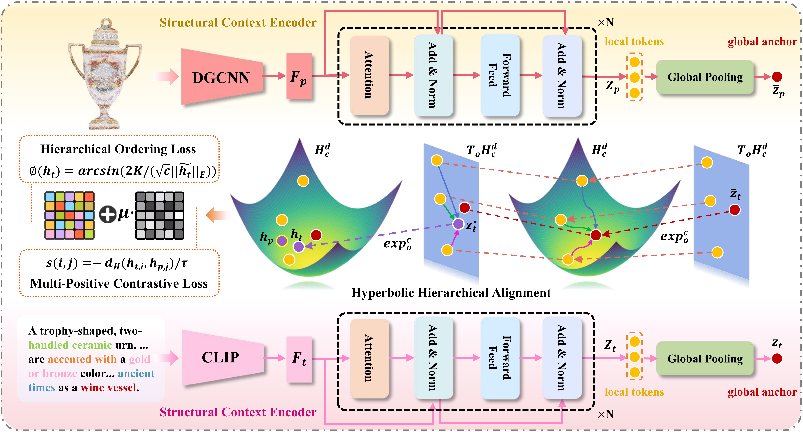

# Hyperbolic Hierarchical Alignment Reasoning Network for Text-3D Retrieval

<div align="center">

[**Wenrui Li<sup>*</sup>**](https://liwrui.github.io/),
**Yidan Lu<sup>*</sup>**,
**Yeyu Chai**,
[**Rui Zhao**](https://ruizhao26.github.io/index.html)
[**Hengyu Man**,](https://homepage.hit.edu.cn/manhengyu)
[**Xiaopeng Fan**](https://scholar.google.cz/citations?hl=zh-CN&user=4LsZhDgAAAAJ&view_op=list_works&sortby=pubdate)

</div>

[](https://arxiv.org/abs/2511.11045)



## Introduction
With the daily influx of 3D data on the internet, text-3D retrieval has gained increasing attention. However, current methods face two major challenges: Hierarchy Representation Collapse (HRC) and Redundancy-Induced Saliency Dilution (RISD). HRC compresses abstract-to-specific and whole-to-part hierarchies in Euclidean embeddings, while RISD averages noisy fragments, obscuring critical semantic cues and diminishing the model’s ability to distinguish hard negatives. To address these challenges, we introduce the Hyperbolic Hierarchical Alignment Reasoning Network (H<sup>2</sup>ARN) for text-3D retrieval. H<sup>2</sup>ARN embeds both text and 3D data in a Lorentz-model hyperbolic space, where exponential volume growth inherently preserves hierarchical distances. A hierarchical ordering loss constructs a shrinking entailment cone around each text vector, ensuring that the matched 3D instance falls within the cone, while an instance-level contrastive loss jointly enforces separation from non-matching samples. To tackle RISD, we propose a contribution-aware hyperbolic aggregation module that leverages Lorentzian distance to assess the relevance of each local feature and applies contribution-weighted aggregation guided by hyperbolic geometry, enhancing discriminative regions while suppressing redundancy without additional supervision. We also release the expanded T3DR-HIT v2 benchmark, which contains 8,935 text-to-3D pairs, 2.6 times the original size, covering both fine-grained cultural artefacts and complex indoor scenes.

## Download data

Uploading...

Our T3DR-HIT v2 dataset is an expanded version of the original T3DR-HIT benchmark introduced by [RMARN](https://github.com/liwrui/RMARN). 
* **Download**: [**Click here to download T3DR-HIT v2**](https://pan.baidu.com/s/1Moa2hHpj9g2y76h9Gb2qMw?pwd=bstd)
* **Setup**: After downloading, please unzip and place the contents (`Elephant` and `S3DIS` folders) into the `./data/` directory.

## Requirements

```
pip install -r requirements.txt
```

## Train

The training process consists of two main steps: feature extraction and model training.

### Step 1: Feature Extraction

First, you must pre-process the raw data into feature files. We use `get_feature_link_Elephant.py` as an example. This script will automatically process both `train` and `test` splits.

```
# Ensure you have pre-trained weights for
# - DGCNN, PointNet, PointNet++
# - CLIP, BERT
# and place them in their respective folders under ./save/

# Run feature extraction for the Elephant Meta Dataset
python get_feature_link_Elehant.py \
    --base_data_dir ./data/Elephant \
    --pc_model DGCNN \
    --txt_model CLIP \
    --num_points 10000
```

### Step 2: Training the Retrieval Model

Once the features are extracted, run `train.py` to train the retrieval model. Example usage:

```
python train.py \
    --save_model_path ./best_model/bestEle.pth \
    --checkpoint_path ./checkpoint/Ele.pth \
    --d_txt 512 \
    --d_pcd 512 \
    --d_model 512 \
    --batch_size 256 \
    --num_epochs 100 \
    --learning_rate 0.002 \
    --nhead 64 \
    --num_layers 6
```

## Inference

To evaluate a trained model, run `inference.py`. Example usage:

```
python inference.py \
    --best_model_path ./best_model/bestEle.pth \
    --test_txt_path ./feature/Elephant/test/txt_features_CLIP.pt \
    --test_cld_path ./feature/Elephant/test/pc_features_DGCNN.pt \
    --test_link_path ./save/Elephant_link_test.json \
    --d_txt 512 \
    --d_pcd 512 \
    --d_model 512 \
    --nhead 64 \
    --num_layers 6
```

## Reference

If you found this code useful, please cite the following paper:

```
@misc{li2025hyperbolichierarchicalalignmentreasoning,
      title={Hyperbolic Hierarchical Alignment Reasoning Network for Text-3D Retrieval}, 
      author={Wenrui Li and Yidan Lu and Yeyu Chai and Rui Zhao and Hengyu Man and Xiaopeng Fan},
      year={2025},
      eprint={2511.11045},
      archivePrefix={arXiv},
      primaryClass={cs.CV},
      url={https://arxiv.org/abs/2511.11045}, 
}
```
